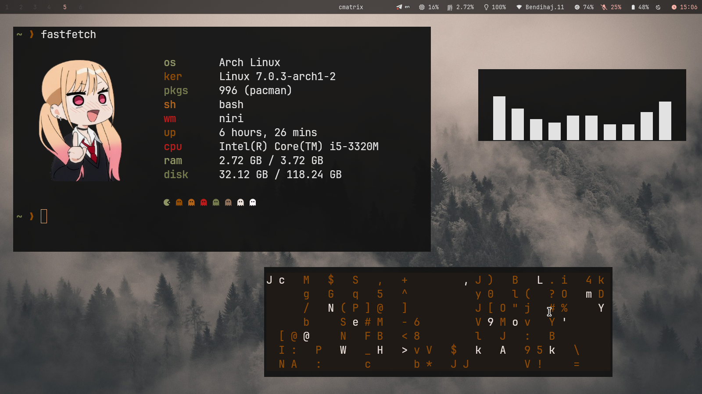
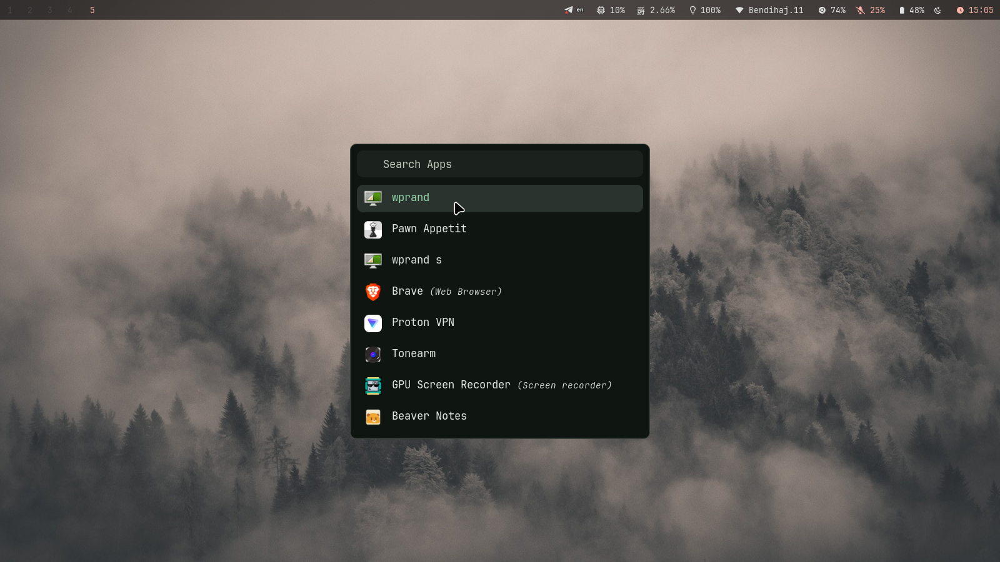

# sarok-area

My Arch Linux desktop configuration — Niri Wayland compositor with warm accent theming.




## Stack

| Component | Choice |
|-----------|--------|
| **WM** | Niri (scrolling tiler) |
| **Bar** | Waybar |
| **Launcher** | Rofi |
| **Notifications** | Swaync |
| **Terminal** | Kitty |
| **Shell** | Bash + Starship |
| **GTK Theme** | Orchis-Purple-Dark-Compact |
| **Icons** | Linox-Slate |
| **Cursor** | Bibata-Modern-Classic |
| **Font** | JetBrainsMono Nerd Font |
| **Accent** | `#ffb4a9` |

## Setup

```bash
git clone https://github.com/sarok-exe/sarok-area.git
cd sarok-area
./setup.sh
```

The setup script installs packages, copies configs, themes, icons, and system files.
